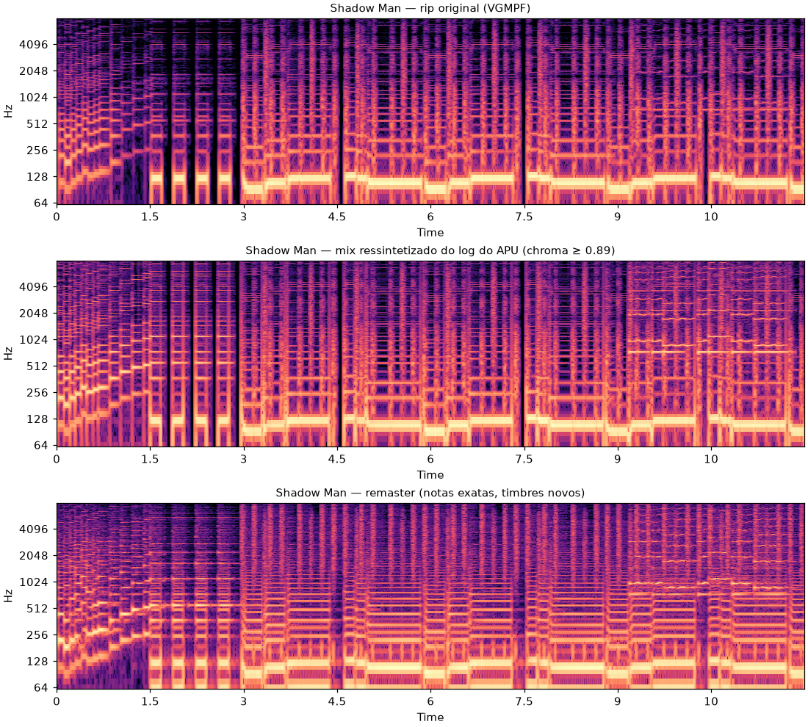

# MesenCE — sbihaiko's fork

A personal fork of [MesenCE](https://github.com/nesdev-org/MesenCE) (itself a fork of [Mesen](https://github.com/SourMesen/Mesen2)), a multi-system emulator for Windows, Linux, and macOS covering NES, SNES, Game Boy (GB/SGB/GBC), Game Boy Advance, PC Engine, SMS/Game Gear, and WonderSwan (WS/WSC).

## Enhanced Audio (NES, SMS, Game Gear, SG-1000, ColecoVision)

This fork adds an experimental **Enhanced Audio** mode for the NES (2A03 APU) and SMS-family (SN76489 PSG, shared by SMS, Game Gear, SG-1000 and ColecoVision) cores: an alternative synthesizer that reinterprets the live chip channel state (frequency, volume, and duty on the NES) with modern instrument timbres in real time, on any ROM, with zero per-game assets. The original chip stays the source of truth — the synth only reads its state and mixes on top of (or replaces) the original chip output. **It's on by default** (Style: Studio). Since the setting applies across every supported console, it lives in one place: **Settings → Audio → General tab → "Enhanced audio (experimental)"**, where you can toggle it, pick a Style, and adjust the synth volume and original chip mix. Each console runs its own synth mapping and its own set of built-in styles tuned for that chip (on top of one shared DSP engine), but they share this single on/off switch. **Only the NES and SMS-family cores actually implement it** — on every other console (SNES, Game Boy, GBA, PC Engine, WonderSwan) the checkbox is visible but has no effect. Also note the per-console *channel volume* settings (e.g. Settings → NES/SMS → Audio) only affect the original chip output — muting a channel there does not mute the corresponding enhanced synth voice.

On SMS-family titles that switch their soundtrack over to the optional YM2413 FM add-on (e.g. *After Burner*, *Shadow Dancer*) and mute the PSG entirely, the SMS engine also reinterprets the FM chip's own live register state (frequency, volume, key-on, up to 9 simultaneous notes) so those games get enhanced music too, not just PSG-only titles like *Fantasy Zone*. When a game mutes the PSG through the audio control port, the synth stops reinterpreting the PSG registers as well, so stale notes/noise never play under the FM voices. FM's rhythm/percussion mode is left untouched for now.

Five built-in styles are included per engine: Synthwave, Chip Deluxe, Orchestral Lite, Dry, and Studio (a port of an offline remaster mix, with a fixed detuned-saw lead and a light bus compressor). Every instrument parameter can also be tuned without recompiling, via an `EnhancedAudioPresets.cfg` file placed in the Mesen home folder — the NES engine reads sections like `[Studio]`, the SMS-family engine reads `[Studio.Sms]`, so both can be tuned independently from the same file. Edits to the file are picked up on console reset / ROM load (the file is never read from the audio path).

This feature was originally proposed upstream as [PR #262](https://github.com/nesdev-org/MesenCE/pull/262). It was built with the help of AI tools, which the upstream project's contribution policy does not allow, so the PR was closed and this work now lives here instead, for personal use.

### Hear it

Mega Man 3, Shadow Man stage. **Before** is the original NES chip audio; **after** is the reference mix the **Studio** preset is a verbatim port of — melody and timing come straight from the game's own APU register log, only the instrument timbres change.

| 🔊 Before (original NES) | 🔊 After (Enhanced Audio — Studio) |
|---|---|
| [shadowman-before.mp3](https://raw.githubusercontent.com/sbihaiko/MesenCE/master/docs/media/shadowman-before.mp3) | [shadowman-enhanced.mp3](https://raw.githubusercontent.com/sbihaiko/MesenCE/master/docs/media/shadowman-enhanced.mp3) |

## Development Builds

* [Windows](https://nightly.link/sbihaiko/MesenCE/workflows/build/master/Mesen%20%28Windows%20-%20net10.0%20-%20AoT%29.zip)
  * Windows 7 or higher is required. Windows 7 users must use SP1 and have all updates installed.
* [Linux x64](https://nightly.link/sbihaiko/MesenCE/workflows/build/master/Mesen%20%28Linux%20-%20ubuntu-22.04%20-%20clang_aot%29.zip)  (requires **SDL2**)  
* [Linux ARM64](https://nightly.link/sbihaiko/MesenCE/workflows/build/master/Mesen%20%28Linux%20-%20ubuntu-22.04-arm%20-%20clang_aot%29.zip)  (requires **SDL2**)  
* [macOS - Intel](https://nightly.link/sbihaiko/MesenCE/workflows/build/master/Mesen%20%28macOS%20-%20macos-15-intel%20-%20clang_aot%29.zip)  (requires **SDL2**)  
* [macOS - Apple Silicon](https://nightly.link/sbihaiko/MesenCE/workflows/build/master/Mesen%20%28macOS%20-%20macos-15%20-%20clang_aot%29.zip)  (requires **SDL2**)  

Other builds (per-commit) are available in the [Actions](https://github.com/sbihaiko/MesenCE/actions/workflows/build.yml?query=branch%3Amaster) tab. macOS builds are self-signed and require approval via Gatekeeper before they can run.

## License

Mesen is available under the GPL V3 license.  Full text here: <http://www.gnu.org/licenses/gpl-3.0.en.html>
Copyright (C) 2014-2026 Sour, 2026 contributors
